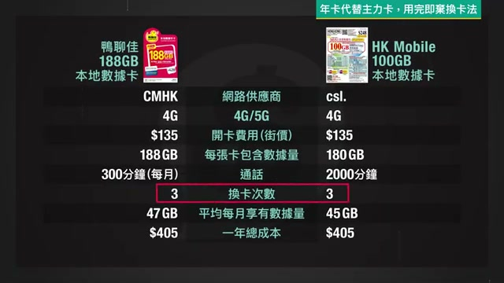
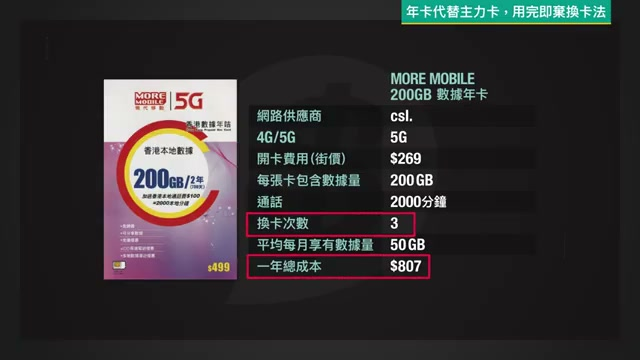

# 【2026 年卡攻略】HK Annual Prepaid SIM Guide

> Original title: 【2026 年卡攻略】每月唔使$70就有50GB 5G數據！平過上台？養號碼/Wi-Fi蛋/5G高用量邊張最抵？

## 📖 About This Video

Price.com.hk's 2026 buying guide for Hong Kong **年卡 (annual prepaid SIM cards)** — validity measured in *years*, from a few tens of dollars, now with eSIM + 5G. It splits the market by need via a "揀卡三步曲" (3-step pick): (1) cheapest way to **keep a phone number** (養號碼), (2) high-data cards for a **tablet / Wi-Fi egg**, and (3) replacing your main monthly plan via the **用完即棄換卡法** (use-and-discard swap method) — as low as **$34/month for ~40GB (4G)** or **$68/month for 50GB (5G)**, roughly ⅓–⅕ of a normal HK contract. Ends with 6 pitfalls.

**Channel**: Price.com.hk 香港格價網 · **Analysis mode**: frames + zh-HK subtitles

## 📸 On-Screen Snapshots (the money tables)

**Cheapest "use-and-swap" main card @ 40GB/month (4G):**

| Spec | 鴨聊佳 188GB | HK Mobile 180GB |
|---|---|---|
| Network (供應商) | CMHK | csl. |
| 4G/5G | 4G | 4G |
| Open cost, street (開卡費用街價) | $135 | $135 |
| Data per card | 188 GB | 180 GB |
| Calls (通話) | 300 min/mo | 2000 min |
| **Card swaps/year (換卡次數)** | **3** | **3** |
| Avg data/month | 47 GB | 45 GB |
| **Annual total (一年總成本)** | **$405** | **$405** |

→ **$405/yr = ~$34/month** for ~40 GB/month on 4G.

**Highest 5G option (use-and-swap @ 50GB/month):**

| Spec | MORE MOBILE 200GB 5G |
|---|---|
| Network | csl. · **5G** |
| Open cost, street | $269 |
| Data per card | 200 GB |
| Calls | 2000 min |
| Card swaps/year | 3 |
| Avg data/month | 50 GB |
| **Annual total** | **$807** → ~$68/month |

## 📋 Video Breakdown

| Time | Segment |
|------|---------|
| [00:00](https://www.youtube.com/watch?v=1eA0tTMSvbo&t=0s) | Lead — 年卡 exist; validity in years, from tens of $, eSIM + 5G, up to 4-year |
| [00:42](https://www.youtube.com/watch?v=1eA0tTMSvbo&t=42s) | 低成本養號碼 — cheapest number-keeping cards |
| [02:49](https://www.youtube.com/watch?v=1eA0tTMSvbo&t=169s) | High-data Tablet / Wi-Fi egg cards ($/GB) |
| [05:17](https://www.youtube.com/watch?v=1eA0tTMSvbo&t=317s) | 年卡代替主力卡 — use-and-discard swap method |
| [07:33](https://www.youtube.com/watch?v=1eA0tTMSvbo&t=453s) | 避坑 — 6 pitfalls when buying |

## 🧠 The Three Card Groups (all prices = street, 2026-09-21)

**① Keep a number cheaply (養號碼)**
- **Club SIM (csl.)** — buy a **$15 服務組合** (e.g. 亞太通行證) yearly → auto-extends validity 365 days. ⚠️ Official site has a **$50 minimum order**. Doubles as a travel SIM; physical + eSIM; port-in ~10 working days (+5GB bonus on port-in).
- **HK Mobile 30GB 年卡 (csl.)** — $50–60; 30GB + 2000 min; renew with a **$20 voucher/yr** (+200 min).
- **3HK 國際萬能卡** — $55 to open; physical + eSIM; **~$65/yr** to retain (buy 24GB combo or unlimited local calls).
- **Lucky SIM 3年版** — ~$138 = **~$46/yr**; 30GB + 2000 min + free SMS; 4.5G (≤42 Mbps); **3 years, no annual admin**.

**② Cheapest data ($/GB)**
- **鴨聊佳 (CMHK) 188GB** — $135 → **$0.7/GB** (4G) + 300 min/mo. Best $/GB.
- **HK Mobile 100GB (csl.)** — $94 → **<$1/GB** (4G) + 2000 min.
- **中國聯通 5G 100GB / 200GB** — $95 / ~$165 → **<$1/GB (5G)**; no call minutes.
- **Lucky2 5G 500GB 4年** — $688 → **$1.4/GB** (5G); pure data, **no phone number**; ~10GB/mo over 4 yrs.

**③ Replace main card — 用完即棄換卡法**
- HK avg usage = **~40GB/month** (OFCA, May 2026). Cheapest = 鴨聊佳 188GB **or** HK Mobile 180GB → 3 swaps/yr → **$405/yr = $34/mo (4G)**.
- 5G / better reception → 3HK 132GB or SmarTone 激ValueGB 100GB (4–5 swaps, +$100–200), or MORE Mobile 200GB 5G → **$807/yr = $68/mo (50GB 5G)**.

## 💰 Lowest-Cost Combo Plan (keep a number + cheapest data)

**Design:** separate the *number* from the *data*. Keep one permanent cheap **number-keeper SIM** (never swapped); run a **discardable data card** that you replace when depleted. The data cards' own numbers are thrown away — that's *why* you need the separate keeper.

| Combo | Number-keeper | Data (40GB/mo, 4G) | Monthly total | Notes |
|---|---|---|---|---|
| **A — absolute lowest** | Club SIM, $15/yr | 鴨聊佳 / HK Mobile swap, $405/yr | **~$35/mo** | ⚠️ Club SIM official site has a **$50 min order** → year 1 ≈ $50, not $15. The standalone $15 top-up thereafter is implied but not confirmed in the video. |
| **B — simplest, zero admin** | Lucky SIM 3年, ~$46/yr | 鴨聊佳 / HK Mobile swap, $405/yr | **~$38/mo** | No renewal chores for 3 years; keeper also gives 30GB + 2000 min + free SMS. |
| **5G variant** | either keeper | MORE Mobile 200GB 5G, $807/yr | **~$69–72/mo** | 50GB/mo on 5G; only if you game / stream / video-call. |
| **Light user** | Lucky SIM 3年 alone (~$3.8/mo) | (keeper's own 30GB/3yr) | **~$4/mo** | Number + light data only; no separate data card. |

**Recommendation:** **Combo B (~$38/mo)** for most people — the ~$3/mo premium over A buys three years of zero admin and removes the unverified Club SIM $15/$50 risk. Choose **A** only if you'll actively manage the Club SIM top-up. Go **5G** only if 4G MVNO speed is genuinely insufficient for your use.

### Logistics of running the combo
- **Slot 1 / eSIM:** permanent number-keeper (Club SIM or Lucky SIM). Never swap. Renew once/yr (Club) or once/3yr (Lucky).
- **Slot 2 / physical SIM or Wi-Fi egg:** the data card, swapped **~3×/year**.
- **Each data swap:** ① buy the card at **street price** (not official — cheaper; pitfall #4); ② complete **實名登記 (real-name registration)** before activation, or it won't connect; ③ check the **最後啟用日期** on the sleeve and activate in time; ④ insert as the data SIM; ⑤ discard the old card + its number.
- **Gotchas:** MVNO network priority is lower in crowded areas (weigh your usual coverage); confirm your device supports **eSIM** or buy physical; match **4G vs 5G** to your needs.
- **Re-check prices on Price.com.hk before buying** — street/shop prices differ from official, and these figures are dated 2026-09-21.

## ✏️ Test Yourself
**Q:** Why keep a separate number-SIM instead of porting your number through the swap chain?
**A:** The cheap data cards are use-and-discard; their numbers get thrown away. A permanent keeper SIM holds your number for ~$15–46/yr while the data rotates.

**Q:** Cheapest $/GB card, and is it 5G?
**A:** 鴨聊佳 188GB at $0.7/GB — but **4G**. Cheapest 5G is 聯通 100GB/200GB at <$1/GB.

**Q:** What breaks the $34/month figure?
**A:** It's 4G only, assumes ~40GB/mo and 3 swaps/yr at street prices, and excludes the number-keeper. Add the keeper for the real combo (~$35–38/mo).

## ⚡ Apply It
- [ ] Pick a keeper: **Lucky SIM 3年 (~$138)** for zero admin, or Club SIM if you'll manage top-ups
- [ ] Pick a data card: **鴨聊佳 188GB** or **HK Mobile 180GB** ($135) for 4G; 聯通/MORE for 5G
- [ ] Confirm device eSIM support (or buy physical)
- [ ] On each card: 實名登記 before activation; note 最後啟用日期
- [ ] Set 3 calendar reminders/yr for the data-card swap
- [ ] Price-check on Price.com.hk right before each purchase

## 🏷️ Tags & Routing
- **Wiki topic (Tag → Topic):** `productivity` → `wiki/personal-growth/personal-growth.md`. *(Loose fit — the vault has no telco/consumer bucket; filed under personal-growth as the closest existing topic. Flag if you'd prefer a new `wiki/hk-living` topic.)*
- **Priority:** high — actionable cost-saving for a recurring HK expense.

## 🔗 Explore Next
- Price.com.hk 年卡 category (live prices): https://www.price.com.hk
- OFCA mobile data usage stats (the 40GB/month figure)
- eSIM device-support check before buying

---
**Captured**: 2026-09-22 · **Source**: https://www.youtube.com/watch?v=1eA0tTMSvbo · **Channel**: Price.com.hk 香港格價網
