# Engineering AI-powered productivity in 2026 — Gong State of Revenue AI report

🎥 [Watch on Goldcast](https://gong.ondemand.goldcast.io/on-demand/1f6b9b8c-1787-4d35-b74e-d84c2f710a7d)

## 📖 About This Video

Gong's on-demand webinar launching its **State of Revenue AI 2026** report. **Dan Morgese** (Head of Research & Content, Gong Labs) presents findings and **Shaheli Guha** (Director of Sales & GTM Strategy, PwC) reacts from client work. The central question: MIT found ~95% of companies use AI but only ~5% see bottom-line impact — **what are the top 5% doing differently?** Answer: productivity is now the #1 growth lever, and the teams winning with AI go deep, use revenue-domain AI, and adopt *strategic* (intelligence) use cases rather than just automation.

**Channel**: Gong (Goldcast on-demand) · **Analysis mode**: official English VTT transcript + 12 slide frames

> ⏳ **Staleness:** recorded **2025-12-16** as a *2026 outlook*; captured 2026-09-29 — ~9 months on, several predictions are now observable.
>
> ⚖️ **Vendor research:** Gong Labs data presented by a Gong employee; the back third is Gong-product metrics. The presenter himself calls the "revenue-specific AI wins" finding "a little self-serving." Survey findings and Gong-customer product stats are separated below.

**Methodology:** (1) **Survey** — 3,000+ director-level-and-above revenue leaders, anonymous 25-question online survey via Censuswide + one other panel provider, English-speaking markets only (**US, UK, DACH, Australia** — no APAC-local/HK sample). (2) **Gong Labs product data** — **7.1M opportunities** across **3,600+ companies**, calendar 2025.

## 👁️ Visual Observations (the slides)

*The slides carry the numbers the speaker only describes verbally. Frames captured from the recording at the timestamps shown.*

**1 · [05:40] Revenue growth 2025 — 16% average, down from 19%**
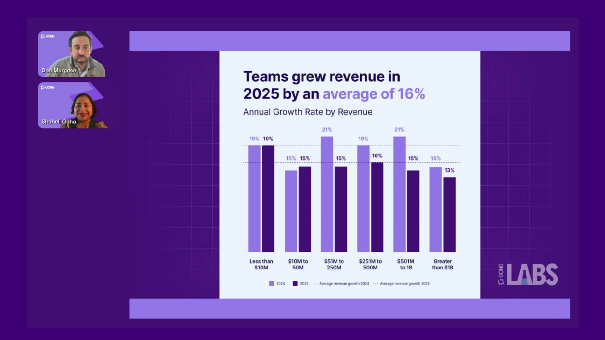

**2 · [07:40] Productivity ranked the #1 growth driver for 2026 (up from #4)**
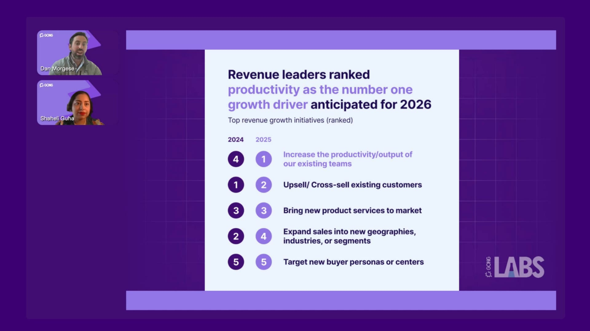

**3 · [15:30] 96% of revenue teams will use AI in 2026**
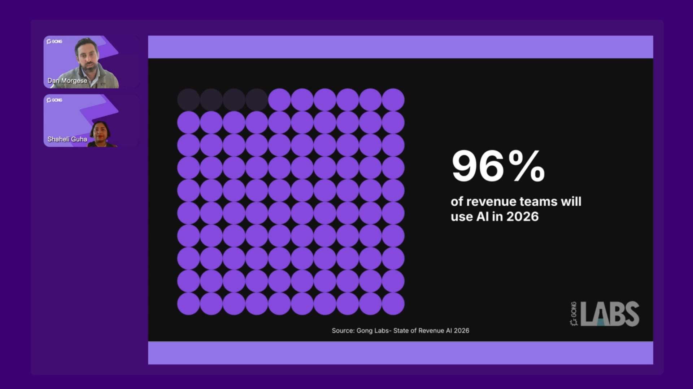

**4 · [18:40] Deeper AI deployments correlate with higher growth (12% → 21%) and commercial impact**
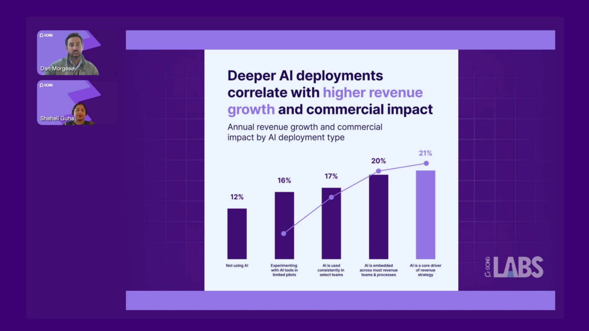

**5 · [24:30] General-purpose AI (72%) exceeds revenue-specific adoption (47%)**
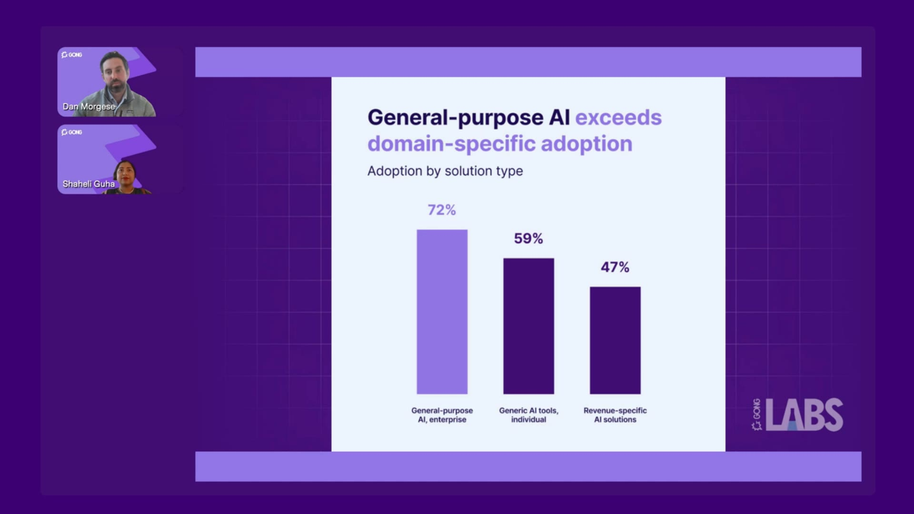

**6 · [26:30] Teams using revenue-domain AI: 2× strategic use cases, +85% commercial impact, +13% growth**
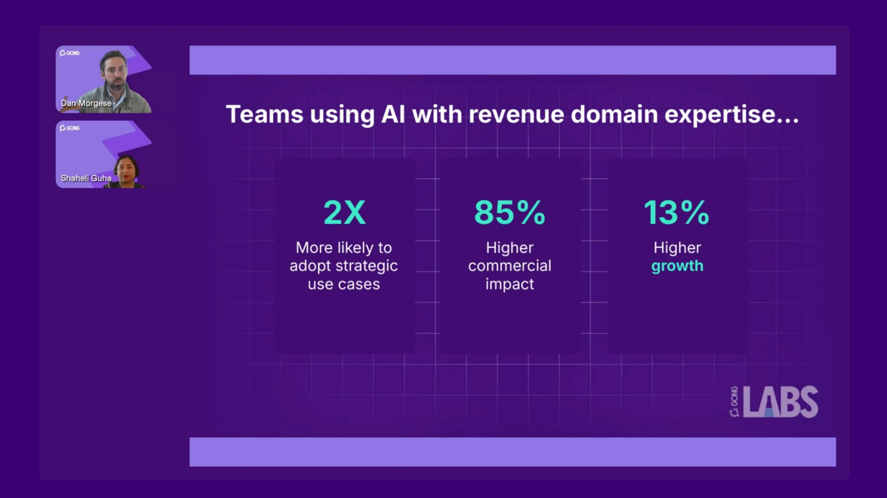

**7 · [28:20] Year-over-year growth by AI use case (2024 vs 2025)**
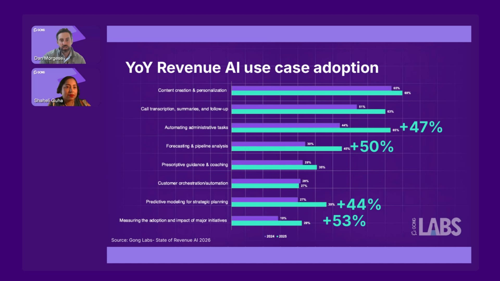

**8 · [34:30] Strategic use-case adoption by commercial-impact percentile (25th → 95th)**
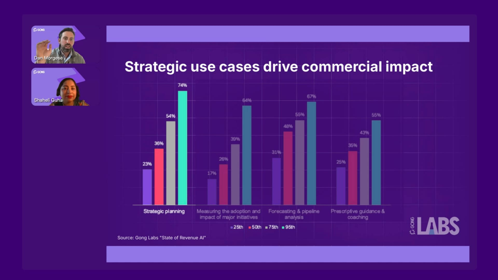

**9 · [36:40] Gong agent: Ask Anything (+82% deal-level, +38% call-level win rate)** *(vendor metric)*
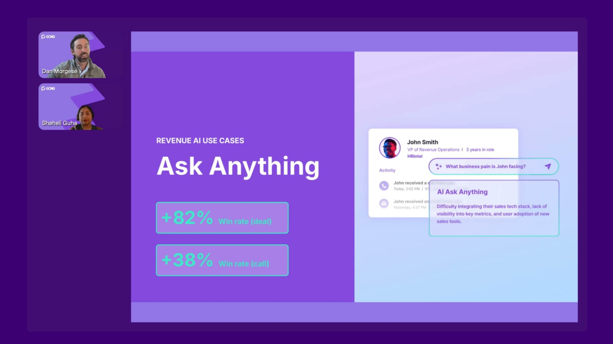

**10 · [40:30] Gong agent: AI Forecast (+20% forecast accuracy)** *(vendor metric)*
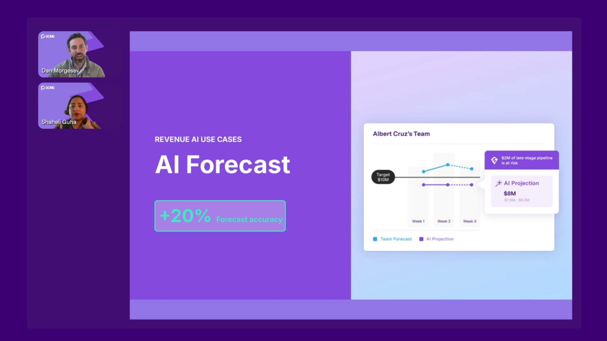

**11 · [43:20] +77% more revenue per rep when using Gong agents** *(vendor metric)*
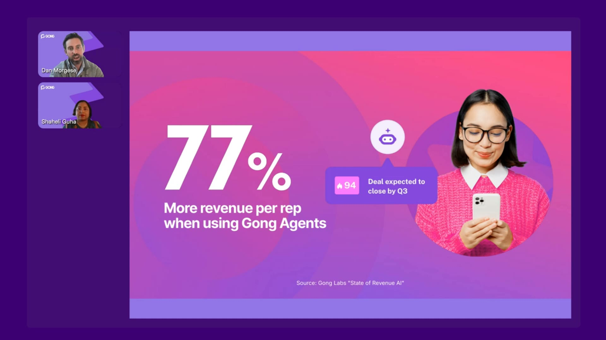

**12 · [44:40] Engineering revenue productivity in 2026: the five takeaways**
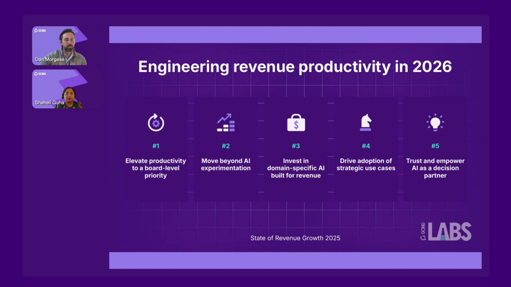

## 📊 Key Findings

**A. Survey findings (3,000+ leaders)**

| Finding | Figure |
|---|---|
| Avg revenue growth 2025 | **16%** (down from **19%** in 2024) — slowed mainly in the larger revenue bands |
| Why growth slowed | Win rate, sales-cycle length, deal size all **flat**; the only drop was **opportunities per seller** |
| #1 growth lever for 2026 | **"Increase productivity of existing teams" — jumped #4 → #1** (first time in the researcher's career); upsell/cross-sell fell #1 → #2; new geographies #2 → #4 |
| AI adoption 2026 | **96%** will use AI (87% now + 9% planning within 12 months) |
| Depth vs growth | Growth climbs with deployment depth: **12%** (not using) → 16% (pilots) → 17% (select teams) → 20% (embedded) → **21%** (core driver of strategy) |
| Trust | **67%** of leaders regularly use AI to inform decisions |
| Adoption by solution type | General-purpose enterprise AI (Gemini/Copilot) **72%** > generic individual tools / shadow AI **59%** > revenue-specific AI **47%** |
| Revenue-domain AI cohort | **2×** more likely to adopt strategic use cases · **+85%** commercial impact · **+13%** growth |
| Fastest-growing use cases YoY | Measuring adoption/impact of big bets **+53%** · forecasting & pipeline **+50%** · admin automation **+47%** · predictive modeling for planning **+44%** |
| Top 5% (commercial-impact index) use AI for | Strategic planning **74%** · forecasting **67%** · measuring big bets **64%** · coaching **55%** |

*Commercial Impact Index = self-reported improvement across 11 revenue KPIs (win rate, forecast accuracy, data quality, cycle time, …).*

**B. Gong-product metrics (vendor-measured, Gong customers only)**

| Agent | Reported effect |
|---|---|
| AI Briefer (deal handoffs) | **+42%** win rate, **−26%** days to close |
| AI Ask Anything | **+38%** win rate at call level; **+82%** at opportunity level |
| AI Trackers (formerly Smart Trackers) | **+35%** win rate |
| AI Forecast (300 contextual signals) | **+20%** more accurate than manual CRM forecast |
| AI Tasker (seller to-dos) | at ≥75% completion: **+50%** win rate, **−13%** deal duration |
| **Frequent agent usage** | **+77% closed-won revenue per rep** |

**How "frequent" is defined (Q&A ~48:00):** a *user* is frequent at **≥10 AI-agent events per opportunity**; a *company* qualifies when **≥20% of its team** are frequent users. Correlation within Gong customers — heavy AI users may simply be stronger reps (selection effect not controlled).

## 📋 Video Breakdown

| Time | Segment |
|------|---------|
| [00:00] | Intro, housekeeping |
| [03:00] | Methodology — Gong Labs 7.1M opps + 3,000-leader survey; English-speaking markets |
| [05:40] | 2025 revenue growth 16% vs 19%; fewer opportunities per seller |
| [07:30] | Growth levers — productivity #4 → #1 |
| [08:30] | PwC: respond to *every* RFP with the same team; sellers spend only 20–30% time actually selling |
| [12:30] | "Treat productivity with the intention of a new product rollout" |
| [14:00] | MIT framing: 95% adopt AI, 5% see impact |
| [15:00] | 96% AI adoption; 2023 experimentation → 2024 edge → 2025 table stakes |
| [18:30] | Deployment depth ↔ growth + Commercial Impact Index |
| [20:30] | Trust: 67% use AI for decisions; hallucination risk |
| [23:30] | Solution types; shadow AI 59% |
| [26:00] | Revenue-domain AI cohort: 2× / +85% / +13% |
| [27:30] | Automation vs intelligence (strategic) use cases |
| [29:30] | PwC: reinvent processes; frontline intel → HQ → product/offers |
| [33:30] | Top-5% use-case profile |
| [35:30] | Gong agents: Briefer, Ask Anything, Trackers |
| [40:00] | AI Forecast +20%; red flag: ≥50% late-stage emails about *scheduling* |
| [42:30] | AI Tasker |
| [43:00] | +77% revenue per rep |
| [44:00] | Five takeaways |
| [46:30] | PwC close — design how you work with AI (data, ethics, workflows) |
| [48:00] | Q&A — frequent-user definition; data sources |

## 🧠 Core Concepts

- **Automation vs intelligence use cases**: automation saves time (draft emails, summaries, follow-ups); intelligence/strategic use cases make people *more successful* (forecasting, coaching, planning, measuring big bets). Impact concentrates in the latter.
- **Deployment depth ladder**: not using → pilots → select teams → embedded across teams → core driver of strategy. Growth rises at each step (12% → 21%).
- **Domain-specific AI**: tools built for revenue workflows shorten time-to-value and make strategic use cases easier to adopt (vendor-favourable claim, but consistent in the survey data).
- **Contextual vs activity signals**: email *volume* looks healthy, but *content* matters — late-stage threads dominated by scheduling predict loss.
- **Shadow AI**: 59% of leaders admit reps use personal AI tools — a data-security gap, likely under-reported.

## 📝 My Learning Notes

### Key Insights
- The 2025 slowdown was a **pipeline-volume problem, not an effectiveness problem** — sellers won just as well, they just worked fewer deals. AI's job is to *create capacity for more opportunities*, not only to polish emails.
- Productivity moving to #1 means it needs the rigour of a launch: owner, enablement, change management, adoption measurement.
- Breadth (general-purpose AI everywhere) ≠ depth. The impact gap sits in **how deep** and **how strategic** the deployment is.
- The PwC RFP example is the clearest "more at-bats with the same headcount" use case.

### Before → After
- **Before**: productivity is an always-on background goal → **After**: a board-level growth lever with a launch plan.
- **Before**: "we use AI" = ChatGPT-drafted emails → **After**: AI in forecasting, coaching, planning and measuring initiatives.
- **Before**: judge deal health by activity counts → **After**: judge by conversational context.

### Questions This Raises
- How much of the "domain-specific AI" advantage survives outside a Gong-run study?
- Does the depth ↔ growth correlation run the other way (growing companies can afford deeper AI)?
- With no APAC-local sample, do these patterns hold in HK / Greater China sales motions?
- Nine months on: did 2026 revenue growth actually rebound where productivity was prioritised?

### Personal Reflections
*Add your own notes here after watching*

## ✏️ Test Yourself

**Q:** Why did average revenue growth fall from 19% to 16% in 2025?
**A:** Win rate, cycle length and deal size stayed flat; sellers simply worked **fewer opportunities**.

**Q:** Which growth lever became #1 for 2026, and where was it before?
**A:** Productivity of existing teams — up from **#4** to **#1**.

**Q:** Which AI solution type is least adopted, and what did its users gain?
**A:** Revenue-specific AI (47%); its users were 2× more likely to adopt strategic use cases, with +85% commercial impact and +13% growth.

**Q:** What counts as a "frequent" AI user in the 77% stat?
**A:** ≥10 AI-agent events per opportunity; a company qualifies when ≥20% of its team is frequent.

**Q:** Name two strategic use cases that top-5% teams use far more than laggards.
**A:** Strategic planning (74%), forecasting (67%), measuring big bets (64%), coaching (55%).

## ⚡ Apply It

*The report's five takeaways, turned into actions:*
- [ ] **Elevate productivity to a board-level priority** — give it an owner, targets and a rollout plan
- [ ] **Move beyond experimentation** — pick one team and go from pilot to embedded
- [ ] **Evaluate domain-specific AI** for revenue workflows (discount the vendor bias; pilot it)
- [ ] **Drive strategic use cases** — forecasting, coaching, planning, measuring initiatives — not just email drafting
- [ ] **Trust and empower AI as a decision partner** — fix the data first to limit hallucinations
- [ ] Audit shadow-AI use and put guardrails in place
- [ ] Download the full report for the 11-dimension Commercial Impact Index breakdown

## ⭐ Rating & Review

After completion:
- **Quality (1-5):** _/5
- **Relevance (1-5):** _/5
- **Would recommend:** Yes / No
- **Best for:** Revenue / sales-ops / GTM leaders sizing AI investments; anyone scoping an AI SDR or sales-AI pilot

## 🏷️ Auto-Generated Tags

**Content Analysis:**
- **Type**: `video` (Goldcast on-demand webinar)
- **Topics**: AI adoption in revenue teams, sales productivity, GTM strategy, forecasting, vendor research
- **Complexity**: deep-dive
- **Priority**: high — directly informs scoping of sales-AI / AI-SDR pilots

**Why These Tags / Routing:**
The vault's Tag → Topic map has no sales/GTM bucket; `AI` routes to `wiki/ai-tools/ai-tools.md`, the closest fit for an AI-adoption study. `business`, `sales`, `revenue-ai`, `gtm`, `research` are descriptive only (unmapped). Deliberately *not* tagged `productivity` (would misroute to personal-growth) or `claude-code` / `agents`.

**Suggested Bases Filters:**
- Find similar content: `type = video AND tags contains "sales"`
- Find unwatched high-priority: `priority = high AND status = inbox AND read = false`

## 🔗 What to Explore Next

- Gong Labs *State of Revenue AI 2026* full report (11-dimension Commercial Impact Index)
- MIT NANDA "GenAI Divide" study (the 95%/5% framing)
- Gong agents: AI Briefer, Ask Anything, AI Trackers, AI Forecast, AI Tasker

---

**Captured**: 2026-09-29
**Source**: https://gong.ondemand.goldcast.io/on-demand/1f6b9b8c-1787-4d35-b74e-d84c2f710a7d
**Channel**: Gong

**Connection to Other Notes:**
- [[notes/2026-06-23-claude-code-ai-sales-automation-study-guide|Study Guide: AI Sales Automation with Claude Code]] — the build-it-yourself side of sales AI
- [[notes/2026-01-14-techradar-vibe-selling-ai-sales-study-guide|Vibe Selling — AI in Sales]] — AI-assisted selling practices
- [[notes/2026-06-23-eric-nowoslawski-claude-code-lead-generation-forever|Claude Code Just Changed Lead Generation Forever]] — AI-driven pipeline generation (the "more opportunities per seller" problem)
- [[wiki/ai-tools/ai-tools|AI Tools]] — AI adoption and agentic tooling
