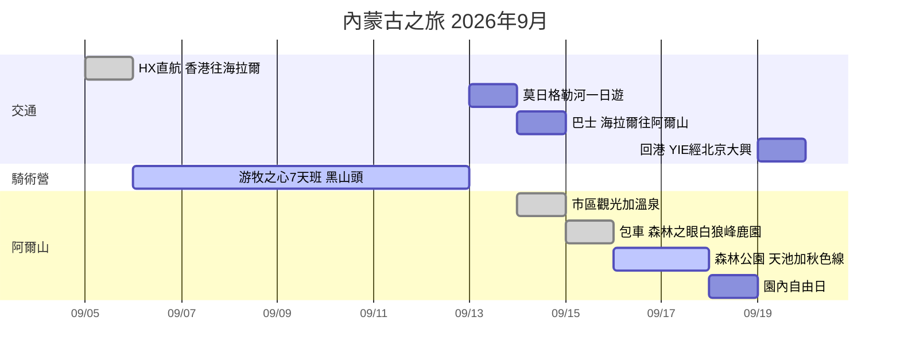

# 🐎 內蒙古騎馬之旅 | 2026-09-05 → 09-19

> 7天游牧之心騎術班（G1 零基礎）+ 阿爾山秋季森林延伸遊
<<<<<<< HEAD
> 獨行 | 經濟艙 | 中檔住宿 | 埋單約 HK$24,900

## 📌 TL;DR

1. ✅ **抵達日（Sep 5）** — HX463 直航 16:40 到海拉爾，傍晚市區觀光（裝備香港/淘寶已買齊），翌朝 9 點營方專車接。
2. ✅ **騎術營（Sep 6–12）** — **黑山頭**馬場 7 日騎術班（G1 零基礎），中段重頭戲 **25km 根河濕地馬背穿越**。
3. ✅ **海拉爾慢遊（Sep 12–13）** — Sep 12 下午返海拉爾；Sep 13 **莫日格勒河**「天下第一曲水」玩到日落，晚上買定巴士飛。
4. **阿爾山段（Sep 14–18）** — Sep 14 巴士入阿爾山（市區聖彼得堡一晚）→ Sep 15 包車遊森林之眼/白狼峰/鹿園，直入 **天池服務區住山乾客棧 4 晚** → Sep 16 天池線、Sep 17 秋色線、Sep 18 園內自由日。
5. **回程（Sep 19）** — Sep 19 朝早由**天池服務區直接的士去 YIE**（~15–20 分鐘，唔返市區）→ JD5686 11:50 YIE→大興 → CZ5009 19:00 → 22:45 到港（兩程已出票，~HK$2,643）。
=======
> 獨行 | 經濟艙 | 中檔住宿 | 總預算約 HK$23,700

## 📌 TL;DR

1. **抵達日（Sep 5）** — 降落海拉爾（HX直航 16:40 到），傍晚市區觀光 + 補齊騎馬裝備，翌朝 9 點騎術學校專車接送。
2. **騎術營（Sep 6–12）** — **黑山頭**馬場 7 日騎術班（G1 零基礎），中段重頭戲 **25km 根河濕地馬背穿越**。7 日風景已覆蓋額爾古納/滿洲里同類景觀（西/中段景點跳過）。
3. **海拉爾慢遊（Sep 12–13）** — Sep 12 下午返海拉爾；Sep 13 **莫日格勒河**「天下第一曲水」一日遊玩到日落（騎馬後恢復日），晚上買定巴士飛。
4. **阿爾山段（Sep 14–18）🔄 已就地重新規劃 → [[阿爾山段-最終版-9月14-18]]** — Sep 14 市區（马帮驿站）→ Sep 15 **先攻2號線駝峰嶺**（高海拔早轉色）→ Sep 16 1號線石塘林/三潭峽，宿天池服務區 → Sep 17 14:30 出園返市區 → **Sep 18 火車賞秋 或 白狼峰追黃葉**（睇秋色實況二選一）。阿爾山天池已刪。
5. **回程（Sep 19）✅ 已定案：直線版** — 11:50 YIE→北京大興（唯一班次，逢二四六飛）→ 19:00 南航 → 22:45 到港。免 4 小時折返巴士，回程 ~HK$2,134。（JD5686+CZ5009 已出票）
>>>>>>> publish: 16 note(s), 0 html

## 🛏️ 過夜城市 & 交通一覽

| 晚 | 日期 | 過夜地點 | 住宿 | 當日交通 |
|----|------|---------|------|---------|
| 1 | Sep 5 | **海拉爾** | 全季（成吉思汗廣場店）✅ | ✈️ HX463 直航 12:05 HKG → 16:40 HLD ✅已飛 |
| 2–7 | Sep 6–11 | **黑山頭馬場** | 營方包食宿 | 🚐 營方專車 Sep 6 朝9點接 |
| 8 | Sep 12 | **海拉爾** | 全季（第2晚）✅ | 🚐 營方送返，15:00 到 |
| 9 | Sep 13 | **海拉爾** | 全季（第3晚）✅ | 🚕 的士來回莫日格勒河（~¥80-100/程），晚上買巴士飛 |
<<<<<<< HEAD
| 10 | Sep 14 | **阿爾山市** | 聖彼得堡大酒店 ✅ | 🚌 巴士 ¥95，4h（S203 經紅花爾基）|
| 11 | Sep 15 | **天池服務區** | 山乾客棧 ✅ | 🚕 包車6小時：森林之眼 → 白狼峰 → 鹿園 → 直入天池服務區 |
| 12 | Sep 16 | **天池服務區** | 山乾客棧（第2晚）| 🚌 換乘站觀光車（步行5分鐘）；1號線天池線；套票 ¥280 48h |
| 13 | Sep 17 | **天池服務區** | 山乾客棧（第3晚）| 🚌 2號線秋色線 |
| 14 | Sep 18 | **天池服務區** | 山乾客棧（第4晚）| 園內自由日 |
| — | Sep 19 | （機上/屋企）| — | 🚕 天池服務區直達 YIE（~15–20分鐘）→ ✈️ JD5686 11:50 YIE→PKX → CZ5009 19:00 → 22:45 HKG（大興 East Pacific 貴賓室已訂）|
=======
| 10 | Sep 14 | **阿爾山市** | 聖彼得堡大酒店 | 🚌 06:30/07:40 巴士，¥95，4h（S203 經紅花爾基，坐左邊窗）|
| 11–12 | Sep 15–16 | **森林公園景區內** | 林溪山莊 | 🚌 07:40 官方班車 ¥21（1.5h）；園內景交套票 ¥280 |
| 13 | Sep 17 | **阿爾山市** | 聖彼得堡（第2晚）| 🚌 14:30 唯一班車出園 ¥21 |
| 14 | Sep 18 | **阿爾山市** | 聖彼得堡（第3晚）| 自由日：溫泉/古蹟/齋抖 |
| — | Sep 19 | （機上/屋企）| — | ✈️ JD5686 11:50 YIE→PKX ✅ → CZ5009 19:00 → 22:45 HKG ✅（大興3樓East Pacific貴賓室已訂）|
>>>>>>> publish: 16 note(s), 0 html

**記法：一條直線唔走回頭 — 海拉爾3晚、馬場6晚全包、阿爾山市1晚、天池服務區4晚打尾，Sep 19 由景區直接飛。**

## 📍 地圖

<link rel="stylesheet" href="https://unpkg.com/leaflet@1.9.4/dist/leaflet.css"/>

## 📅 行程表（自動更新）

新增行程 = 喺呢個資料夾開一個 note，填 frontmatter（`date`/`start`/`end`/`place`/`itinerary: true`），下表自動出現。

| 項目 | 日期 | 開始 | 結束 | 地點 |
| --- | --- | --- | --- | --- |
| [[酒店-海拉爾全季]] | 2026-09-05 |  |  | 海拉爾 |
| [[機票-香港往海拉爾]] | 2026-09-05 | 12:05 | 16:40 | 香港 → 海拉爾 |
| [[海拉爾市區觀光]] | 2026-09-05 | 17:30 | 21:00 | 海拉爾 |
| [[騎術營-游牧之心7天班]] | 2026-09-06 | 09:00 |  | 黑山頭鎮（額爾古納市） |
| [[莫日格勒河一日遊]] | 2026-09-13 | 10:00 | 19:00 | 海拉爾（莫日格勒河） |
| [[酒店-阿爾山聖彼得堡]] | 2026-09-14 |  |  | 阿爾山市區 |
| [[阿爾山段-最終版-9月14-18]] | 2026-09-14 |  |  | 阿爾山 |
| [[巴士-海拉爾往阿爾山]] | 2026-09-14 | 06:30 | 11:40 | 海拉爾 → 阿爾山 |
| [[住宿-天池服務區山乾客棧]] | 2026-09-15 |  |  | 阿爾山國家森林公園 |
| [[阿爾山包車-森林之眼白狼峰鹿園]] | 2026-09-15 |  |  | 阿爾山 |
| [[森林公園-Day1-天池線]] | 2026-09-16 | 07:00 |  | 阿爾山國家森林公園 |
| [[森林公園-Day2-秋色線]] | 2026-09-17 |  |  | 阿爾山國家森林公園 |
| [[森林公園-Day3-園內自由日]] | 2026-09-18 |  |  | 阿爾山國家森林公園（天池服務區） |
| [[回程-返香港]] | 2026-09-19 |  |  | 阿爾山 → 北京大興 → 香港 |

### 今日行程
> [!note]- Dynamic view (Obsidian only)
> This `dataview` block is computed live and renders only in Obsidian.

## ✅ 待辦清單（自動彙總）

**[[住宿-天池服務區山乾客棧]]**
- [ ] **落地確認**（用得閒問下客棧前台/司機）：

**[[回程-返香港]]**
- [ ] 留意 JD5686 班機動態（細機場，起飛前一日 check 多次）
<<<<<<< HEAD

**[[森林公園-Day3-園內自由日]]**
- [ ] 套票 48 小時效期（Sep 16 起計）到今日可能已過 — 如要再搭景交／入景區，確認要唔要另買
=======
- [ ] WeChat Pay / Alipay 綁定（內蒙古以現金+微信支付為主）

**[[森林公園-Day1-天池線]]**
- [ ] Sep 14 買定 07:40 入園班車飛（每日一班，旺季 6:30 排隊）

**[[機票-香港往海拉爾]]**
- [ ] 收到出票 email 後核對電子機票（姓名同回鄉證一致）

**[[酒店-阿爾山聖彼得堡]]**
- [ ] 訂 Sep 14 一晚 → [阿爾山酒店列表](https://hk.trip.com/hotels/list?cityId=1658&provinceId=28&countryId=1&cityName=%E9%98%BF%E7%88%BE%E5%B1%B1&searchWord=%E9%98%BF%E7%88%BE%E5%B1%B1&searchType=CT&optionId=1658&searchValue=19%7C1658*19*1658&checkin=2026-09-14&checkout=2026-09-15&crn=1&adult=1&curr=HKD&locale=zh_hk)
- [ ] 訂 Sep 17–18 兩晚

**[[阿爾山段-最終版-9月14-18]]**
- [ ] **訂 9/15–16 天池服務區住宿** — 打景區官方訂房電話 **0482-7154617**（見下面電話表）
- [ ] **12306 查 9/18 K7593 有冇開行** — 白阿鐵路施工中，呢個係火車日嘅 go/no-go
- [ ] **問旅館老闆／司機：白狼峰黃咗未？森林公園入面呢？** — 本地人情報比任何網上搜尋準
- [ ] **聖彼得堡大酒店**（原計劃 9/14 / 9/17 / 9/18 三晚）— 訂咗未？定已取消？→ [[酒店-阿爾山聖彼得堡]]
- [ ] **「林溪山莊」查無此名** — 搵到最接近係「阿爾山**林緣**度假山莊（國家森林公園店）」（2010開業、4.6分、天池鎮），同筆記寫嘅「9.4分／119評／2025新開／HK$690兩晚」對唔上。訂之前務必核實係咪同一間 → [[住宿-景區內林溪山莊]]
- [ ] **白狼峰資料矛盾**：開放時間有講8:30-17:00、亦有講04:00-20:00；門票有講60/40、亦有講旺季80淡季40。上山可駕車到半山再行石階，或約¥50觀光車直上峰頂。**用App當日查或問民宿老闆。**
- [ ] **9/17 晚市區住宿** — 未訂
- [ ] 包車報價：阿爾山地區約 ¥500–800/日（含司機食宿）

**[[騎術營-游牧之心7天班]]**
- [ ] 讀行前準備：[2026呼倫貝爾騎術班行前準備](https://mp.weixin.qq.com/s/Jft25cMEN9NOvoudB7V5HQ)
>>>>>>> publish: 16 note(s), 0 html

## 📆 時間線

## 💰 預算

| 項目 | 金額 |
|------|------|
| 騎術營 7天（全包） | ~¥11,600 (~HK$12,500) |
<<<<<<< HEAD
| 機票 HKG→HLD（HX463） | HK$2,503 |
| 回程機票（JD5686 + CZ5009） | HK$2,643 |
| 全季海拉爾 3晚 | HK$2,063 |
| 聖彼得堡 1晚 + 山乾客棧 4晚 | ~HK$1,500（實數待埋單） |
| 騎馬裝備（淘寶+香港） | ~HK$600 |
| 交通（巴士+景交+包車+的士） | ~¥1,200 (~HK$1,300) |
| 餐飲雜費 | ~¥1,700 (~HK$1,800) |
| **合計** | **~HK$24,900** |
=======
| 機票 HKG→HLD | HK$2,503 |
| 回程機票 YIE+PKX | HK$2,134 |
| 酒店 8晚 | ~HK$4,091（全季已訂 $2,062.66 + 聖彼得堡估 $1,338 + 林溪山莊估 $690）|
| 交通（巴士+景交+的士） | ~¥600 (~HK$650) |
| 餐飲雜費 | ~¥1,700 (~HK$1,800) |
| **合計** | **~HK$23,700** |
>>>>>>> publish: 16 note(s), 0 html

## 📞 重要聯絡

| 對象 | 方式 |
|------|------|
| 游牧之心 葉丹 | WeChat: `horsemans` / +86-150 4975 1015 |
| 阿爾山客運站 | 0482-2256104（Sep 19 的士甩轆先用得著）|
| 游牧之心官網 | http://www.ihorsemen.com |

## 🗾 參考：貓五郎大環線（下次北段用）

![[images/neko-goro-hulunbuir-route-reference.png]]
*[貓五郎 Neko Goro](https://youtu.be/FgG8snEP0Jc?t=157)嘅3,000km自駕環線。同本行程重疊：海拉爾、阿爾山；佢有我冇（留待2027冬季北征）：漠河/北極村、根河（冷極+馴鹿）、滿歸、室韋、滿洲里/呼倫湖（葉丹✗）、柴河。*

## 📝 備注（留俾下次）
- 呼倫貝爾營期：5月初–10月初（國慶後停業）
- 住宿研究（民宿/青旅，下次識人向可用）：[[參考-民宿青旅]]
