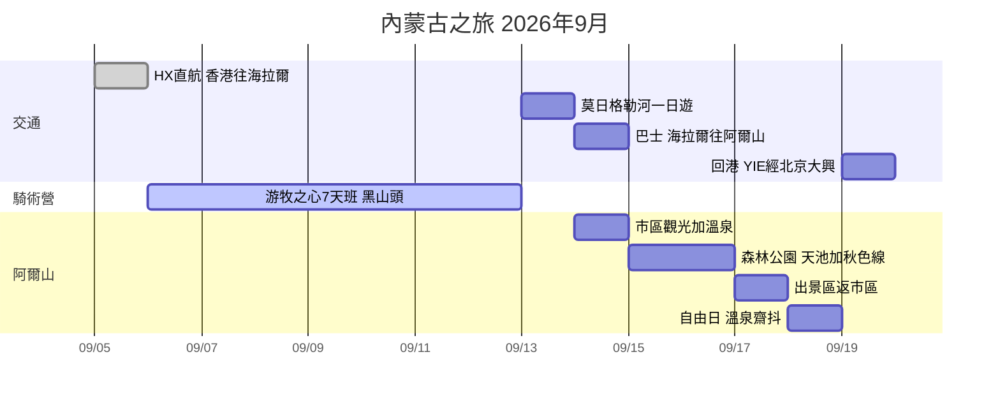

# 🐎 內蒙古騎馬之旅 | 2026-09-05 → 09-19

> 7天游牧之心騎術班（G1 零基礎）+ 阿爾山秋季森林延伸遊
> 獨行 | 經濟艙 | 中檔住宿 | 總預算約 HK$23,600

## 📌 TL;DR

1. **抵達日（Sep 5）** — 降落海拉爾（HX直航 16:40 到），傍晚市區觀光 + 補齊騎馬裝備，翌朝 9 點騎術學校專車接送。
2. **騎術營（Sep 6–12）** — **黑山頭**馬場 7 日騎術班（G1 零基礎），中段重頭戲 **25km 根河濕地馬背穿越**。7 日風景已覆蓋額爾古納/滿洲里同類景觀（西/中段景點跳過）。
3. **海拉爾慢遊（Sep 12–13）** — Sep 12 下午返海拉爾；Sep 13 **莫日格勒河**「天下第一曲水」一日遊玩到日落（騎馬後恢復日），晚上買定巴士飛。
4. **阿爾山段（Sep 14–18）** — Sep 14 巴士入阿爾山（經紅花爾基，坐左邊窗）→ 市區溫泉一晚 → 國家公園兩日（1號線天池 + 2號線秋色）宿景區內 → Sep 17 出園 → **Sep 18 自由日**（溫泉/齋抖）。
5. **回程（Sep 19）✅ 已定案：直線版** — 11:50 YIE→北京大興（唯一班次，逢二四六飛）→ 19:00 南航 → 22:45 到港。免 4 小時折返巴士，回程 ~HK$2,134。（JD5686+CZ5009 已出票）

## 🛏️ 過夜城市 & 交通一覽

| 晚 | 日期 | 過夜地點 | 住宿 | 當日交通 |
|----|------|---------|------|---------|
| 1 | Sep 5 | **海拉爾** | 全季（成吉思汗廣場店）✅ | ✈️ HX463 直航 12:05 HKG → 16:40 HLD ✅已飛 |
| 2–7 | Sep 6–11 | **黑山頭馬場** | 營方包食宿 | 🚐 營方專車 Sep 6 朝9點接 |
| 8 | Sep 12 | **海拉爾** | 全季（第2晚）✅ | 🚐 營方送返，15:00 到 |
| 9 | Sep 13 | **海拉爾** | 全季（第3晚）✅ | 🚕 的士來回莫日格勒河（~¥80-100/程），晚上買巴士飛 |
| 10 | Sep 14 | **阿爾山市** | 聖彼得堡大酒店 | 🚌 06:30/07:40 巴士，¥95，4h（S203 經紅花爾基，坐左邊窗）|
| 11–12 | Sep 15–16 | **森林公園景區內** | 林溪山莊 | 🚌 07:40 官方班車 ¥21（1.5h）；園內景交套票 ¥280 |
| 13 | Sep 17 | **阿爾山市** | 聖彼得堡（第2晚）| 🚌 14:30 唯一班車出園 ¥21 |
| 14 | Sep 18 | **阿爾山市** | 聖彼得堡（第3晚）| 自由日：溫泉/古蹟/齋抖 |
| — | Sep 19 | （機上/屋企）| — | ✈️ JD5686 11:50 YIE→PKX ✅ → CZ5009 19:00 → 22:45 HKG ✅（大興3樓East Pacific貴賓室已訂）|

**記法：一條直線唔走回頭 — 海拉爾3晚連住尾段冇份，阿爾山市3晚（夾住景區2晚），馬場6晚全包。**

## 📍 地圖

<link rel="stylesheet" href="https://unpkg.com/leaflet@1.9.4/dist/leaflet.css"/>

## 📅 行程表（自動更新）

新增行程 = 喺呢個資料夾開一個 note，填 frontmatter（`date`/`start`/`end`/`place`/`itinerary: true`），下表自動出現。

| 項目 | 日期 | 開始 | 結束 | 地點 |
| --- | --- | --- | --- | --- |
| [[酒店-海拉爾全季]] | 2026-09-05 |  |  | 海拉爾 |
| [[機票-香港往海拉爾]] | 2026-09-05 | 12:05 | 16:40 | 香港 → 海拉爾 |
| [[海拉爾市區觀光]] | 2026-09-05 | 17:30 | 21:00 | 海拉爾 |
| [[騎術營-游牧之心7天班]] | 2026-09-06 | 09:00 |  | 黑山頭鎮（額爾古納市） |
| [[莫日格勒河一日遊]] | 2026-09-13 | 10:00 | 19:00 | 海拉爾（莫日格勒河） |
| [[酒店-阿爾山聖彼得堡]] | 2026-09-14 |  |  | 阿爾山市區 |
| [[巴士-海拉爾往阿爾山]] | 2026-09-14 | 06:30 | 11:40 | 海拉爾 → 阿爾山 |
| [[住宿-景區內林溪山莊]] | 2026-09-15 |  |  | 阿爾山國家森林公園 |
| [[森林公園-Day1-天池線]] | 2026-09-15 | 07:40 |  | 阿爾山國家森林公園 |
| [[森林公園-Day2-秋色線]] | 2026-09-16 |  |  | 阿爾山國家森林公園 |
| [[森林公園-Day3-出園]] | 2026-09-17 | 14:30 |  | 阿爾山國家森林公園 → 市區 |
| [[阿爾山自由日]] | 2026-09-18 |  |  | 阿爾山市 |
| [[回程-返香港]] | 2026-09-19 |  |  | 阿爾山 → 北京大興 → 香港 |

### 今日行程
> [!note]- Dynamic view (Obsidian only)
> This `dataview` block is computed live and renders only in Obsidian.

## ✅ 待辦清單（自動彙總）

**[[住宿-景區內林溪山莊]]**
- [ ] 訂 Sep 15–17 兩晚 → [景區內住宿列表（已篩選）](https://hk.trip.com/hotels/list?cityId=1658&provinceId=28&countryId=1&cityName=%E9%98%BF%E7%88%BE%E5%B1%B1&destName=%E9%98%BF%E7%88%BE%E5%B1%B1&checkin=2026-09-15&checkout=2026-09-17&crn=1&adult=1&listFilters=29~1*29*1~1*2%2C17~1*17*1%2C50~8~13154*8*13154~47.275067273008304~120.29935542082508~2%2C80~0~1*80*0&curr=HKD&locale=zh_hk)

**[[回程-返香港]]**
- [ ] 留意 JD5686 班機動態（細機場，起飛前一日 check 多次）
- [ ] WeChat Pay / Alipay 綁定（內蒙古以現金+微信支付為主）

**[[巴士-海拉爾往阿爾山]]**
- [ ] Sep 13 晚（莫日格勒河返嚟後）喺客運站**預買**翌日車飛（旺季或滿座）
- [ ] 買飛時順便問司機行 S203 定 G332（G332 會經諾門罕戰役遺址，一般行 S203）

**[[森林公園-Day1-天池線]]**
- [ ] Sep 14 買定 07:40 入園班車飛（每日一班，旺季 6:30 排隊）

**[[機票-香港往海拉爾]]**
- [ ] 收到出票 email 後核對電子機票（姓名同回鄉證一致）

**[[莫日格勒河一日遊]]**
- [ ] 的士約車 / 滴滴（酒店前台可幫手）

**[[酒店-阿爾山聖彼得堡]]**
- [ ] 訂 Sep 14 一晚 → [阿爾山酒店列表](https://hk.trip.com/hotels/list?cityId=1658&provinceId=28&countryId=1&cityName=%E9%98%BF%E7%88%BE%E5%B1%B1&searchWord=%E9%98%BF%E7%88%BE%E5%B1%B1&searchType=CT&optionId=1658&searchValue=19%7C1658*19*1658&checkin=2026-09-14&checkout=2026-09-15&crn=1&adult=1&curr=HKD&locale=zh_hk)
- [ ] 訂 Sep 17–18 兩晚

**[[騎術營-游牧之心7天班]]**
- [ ] 讀行前準備：[2026呼倫貝爾騎術班行前準備](https://mp.weixin.qq.com/s/Jft25cMEN9NOvoudB7V5HQ)

## 📆 時間線

## 💰 預算

| 項目 | 金額 |
|------|------|
| 騎術營 7天（全包） | ~¥11,600 (~HK$12,500) |
| 機票 HKG→HLD | HK$2,503 |
| 回程機票 YIE+PKX | HK$2,134 |
| 酒店 8晚 | ~HK$3,620 |
| 交通（巴士+景交+的士） | ~¥600 (~HK$650) |
| 餐飲雜費 | ~¥1,700 (~HK$1,800) |
| **合計** | **~HK$23,600** |

## 📞 重要聯絡

| 對象 | 方式 |
|------|------|
| 游牧之心 葉丹 | WeChat: `horsemans` / +86-150 4975 1015 |
| 馬場收件（德軍） | 13722015698（額爾古納市黑山頭鎮梁西村） |
| 阿爾山客運站 | 0482-2256104 |
| 游牧之心官網 | http://www.ihorsemen.com |

## 🗾 參考：貓五郎大環線（下次北段用）

![[images/neko-goro-hulunbuir-route-reference.png]]
*[貓五郎 Neko Goro](https://youtu.be/FgG8snEP0Jc?t=157)嘅3,000km自駕環線。同本行程重疊：海拉爾、阿爾山；佢有我冇（留待2027冬季北征）：漠河/北極村、根河（冷極+馴鹿）、滿歸、室韋、滿洲里/呼倫湖（葉丹✗）、柴河。*

## 📝 備注
- 識人向住宿研究（民宿/青旅小紅書連結）：[[參考-民宿青旅小紅書]]（純討論，行程照舊）
- 9月中旬草原早晚涼，帶保暖層（參考葉丹提供 2021-08-29 溫度記錄）
- 呼倫貝爾營期：5月初–10月初（國慶後停業）
- 快遞：京東/德邦到唔到黑山頭，其他快遞可以（時效+1~2天）
- 行前準備：[2026呼倫貝爾騎術班行前準備](https://mp.weixin.qq.com/s/Jft25cMEN9NOvoudB7V5HQ)（WeChat 內開）
